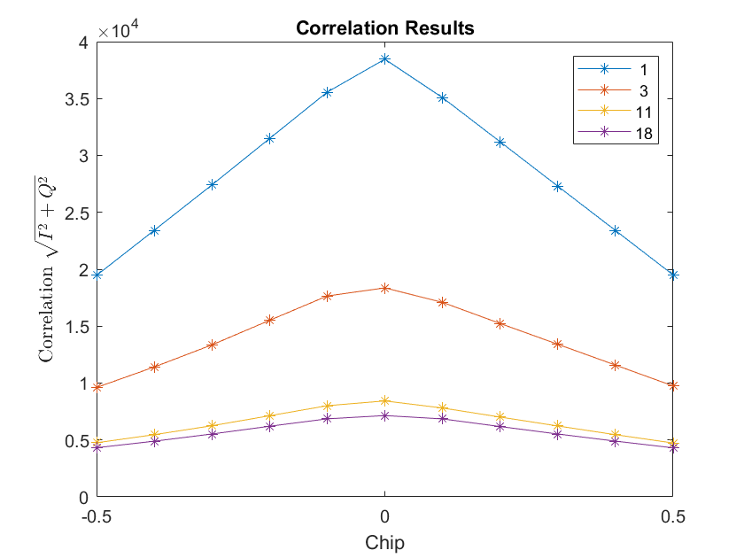
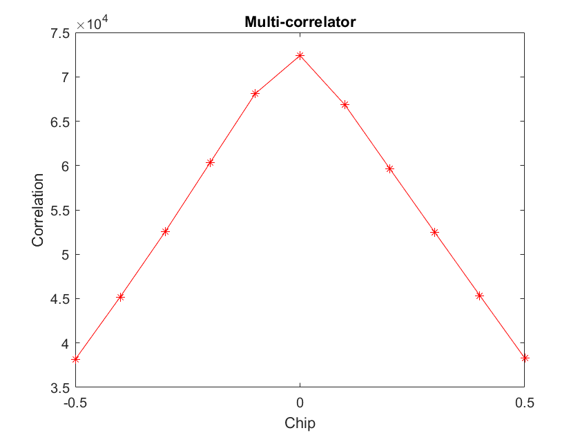

# AAE6102 Satellite Navigation Project

[toc]

I chose SoftGNSS for data processing. SoftGNSS is a open source MATLAB software defined receiver provided by *A Software-Defined GPS and Galileo Receiver: A Single-Frequency Approach* by Borre, Akos, et.al. The structure of the SDR is shown in Figure 0.1.

> **Figure 0.1** SoftGNSS Diagram
>
> 

## Task 1

> Process the IF data using a GNSS SDR and generate the initial acquisition results.

The acquisition metric threshold is set to 1.5. For Open-sky collected IF data, 5 GPS satellites were acquired (SV 16, 22, 26, 27, 31). For Urban IF data, 4 GPS satellites were acquired (SV 1, 3, 11, 18). Affected by tall buildings, Urban acquired fewer satellites than Open-sky.

> **Figure 1.1** Open-sky Acquired Satellites
> 
> 

> **Figure 1.2** Urban Acquired Satellites
> 
> 

For Open-sky IF data, choose an acquired satellite (SV 16) and a not-acquired satellite (SV 17), and plot the acquired results. It's clear that there is a obvious peak in SV 16, and there are only noises in SV 17. If the ratio of the peak value to the second peak value of the correlation value is greater than the threshold value (1.5), the acquisition is considered successful.

> **Figure 1.3** Acquired Satellite SV 16
>
> 

> **Figure 1.4** Not Acquired Satellite SV 17
>
> 

## Task 2

> Adapt the tracking loop (DLL) to generate correlation plots and analyze the tracking performance. Discuss the impact of urban interference on the correlation peaks. (Multiple correlators must be implemented for plotting the correlation function.)

The discriminator of SoftGNSS is:

$$\delta_{cp}=\dfrac{\sqrt{I_E^2+Q_E^2} - \sqrt{I_L^2+Q_L^2}}{\sqrt{I_E^2+Q_E^2} + \sqrt{I_L^2+Q_L^2}}$$

Correlation results for open-sky and urban data are shown in Figure 2.1 and Figure 2.2. In opensky environments, the correlation peak is shaper while in urban environments, the correlation peak is less sharper. Affected by multipath, Urban's correlation peak is not symmetrical.

> **Figure 2.1** Open-sky Correlator
>
> 
>
> 

> **Figure 2.2** Urban Correlator
>
> 
>
> 

## Task 3

> Decode the navigation message and extract key parameters, such as ephemeris data, for at least one satellite.

Take satellite SV 16 in open-sky data as an example. The navigation message was decoded in `NAVdecoding.m`. 

> **Figure 3.1** Navigation Message of SV 16 in Open-sky Data
>
> 

**Table 3.1** Detailed Navigation Message of SV 16 in Open-sky Data

| **Parameter** | **Value**              | **Remark**                                                                     |
| ------------- | ---------------------- | ------------------------------------------------------------------------------ |
| C_ic          | \-1.00582838058472e-07 | Amplitude of the cosine harmonic correction term for the angle of inclination. |
| omega_0       | \-1.6742614288517      | Longitude of the ascending node at the reference time (radians).               |
| C_is          | 1.3597309589386e-07    | Amplitude of the sine harmonic correction term for the angle of inclination.   |
| i_0           | 0.971603403113095      | Inclination angle at the reference time (radians).                             |
| C_rc          | 237.6875               | Amplitude of the cosine harmonic correction term for the orbital radius.       |
| omega         | 0.679609496852005      | Argument of perigee (radians).                                                 |
| omegaDot      | \-8.01283376668916e-09 | Rate of change of the argument of perigee (radians/second).                    |
| IODE_sf3      | 9                      | Issue of Data Ephemeris (IODE) for subframe 3.                                 |
| iDot          | \-4.89306095848636e-10 | Rate of change of the inclination angle (radians/second).                      |
| idValid       | [2 0 3]                | Indicates the validity of the data (e.g., satellite health).                   |
| weekNumber    | 1155                   | GPS week number (since January 6, 1980).                                       |
| accuracy      | 0                      | User Range Accuracy (URA) index (0 = highest accuracy).                        |
| health        | 0                      | Satellite health status (0 = healthy).                                         |
| T_GD          | \-1.02445483207703e-08 | Group delay differential between L1 and L2 signals (seconds).                  |
| IODC          | 234                    | Issue of Data Clock (IODC) for clock parameters.                               |
| t_oc          | 396000                 | Clock reference time (seconds of the week).                                    |
| a_f2          | 0                      | Clock correction term (quadratic coefficient, seconds/second²).                |
| a_f1          | \-6.3664629124105e-12  | Clock correction term (linear coefficient, seconds/second).                    |
| a_f0          | \-0.000406925100833178 | Clock correction term (constant coefficient, seconds).                         |
| IODE_sf2      | 9                      | Issue of Data Ephemeris (IODE) for subframe 2.                                 |
| C_rs          | 23.34375               | Amplitude of the sine harmonic correction term for the orbital radius.         |
| deltan        | 4.24660545959145e-09   | Mean motion difference from computed value (radians/second).                   |
| M_0           | 0.718116855169473      | Mean anomaly at the reference time (radians).                                  |
| C_uc          | 1.38953328132629e-06   | Amplitude of the cosine harmonic correction term for the argument of latitude. |
| e             | 0.0122962790774181     | Eccentricity of the satellite orbit.                                           |
| C_us          | 7.68713653087616e-06   | Amplitude of the sine harmonic correction term for the argument of latitude.   |
| sqrtA         | 5153.77132225037       | Square root of the semi-major axis of the orbit (meters^0.5).                  |
| t_oe          | 396000                 | Ephemeris reference time (seconds of the week).                                |
| TOW           | 390102                 | Time of Week (TOW) in seconds (used for synchronization).                      |

## Task 4

> Using pseudorange measurements from tracking, implement the Weighted Least Squares (WLS) algorithm to compute the user's position and velocity.
> - Plot the user position and velocity.
> - Compare the results with the ground truth.
> - Discuss the impact of multipath effects on the WLS solution.

Generally speaking, the larger the satellite elevation angle, the better the received signal quality. The square of the sine value of the satellite elevation angle can be used as a weight to solve the equations using the weighted least squares method. 

The solved positions are plotted in Figure 4.1 and 4.2. According to the figures, the open-sky solution error is less than 1 meter, while the urban solution error is 141.8 meter. Affected by the obstruction of buildings, more multipath signals and non-line-of-sight signals are received, resulting in large errors in the calculated positioning.

For the Urban data, since only 4 satellites are available, the system of equations is not overdetermined. The weighted least squares method does not work. For open-sky data, the results obtained by least squares and weighted least squares are very close. In order to test whether weighted least squares can help reduce the error caused by multipath effect, it is necessary to collect data containing more than 4 satellites.

> **Figure 4.1** Open-sky Position
>
> 
>
> 

> **Figure 4.2** Urban Position
>
> 
>
> 

> **Figure 4.3** Open-sky Velocity
>
> 

> **Figure 4.4** Urban Velocity
>
> 

## Task 5

> Develop an Extended Kalman Filter (EKF) using pseudorange and Doppler measurements to estimate user position and velocity.

For extend Kalman filter (EKF), the state function is:

$$x_k = f(x_{k-1},u_k)+w_k$$

The observation function is:

$$z_k=h(x_k)+v_k$$

Linearization by calculating Jacobi matrix:

$$F_k=\dfrac{\partial f}{\partial x}$$

$$H_k=\dfrac{\partial h}{\partial x}$$

The position and velocity obtained by using the EKF are shown in the figure 5.1 and 5.2. For the opensky data, it can be seen that the EKF can smooth both the position and velocity estimates.

> **Figure 5.1** EKF Opensky
>
> 

> **Figure 5.2** EKF Urban
>
> 

## Reference

[1] B. Xu and L.-T. Hsu, “Open-source MATLAB code for GPS vector tracking on a software-defined receiver,” GPS Solut, vol. 23, no. 2, p. 46, Mar. 2019, doi: 10.1007/s10291-019-0839-x.

## Special Thanks

🏵️ Thanks for Claude 3.7 Sonnet. This assisted me when writing code to modify the SDR.

🐋 Thanks for DeepSeek R1. This helped me deriving many equations.